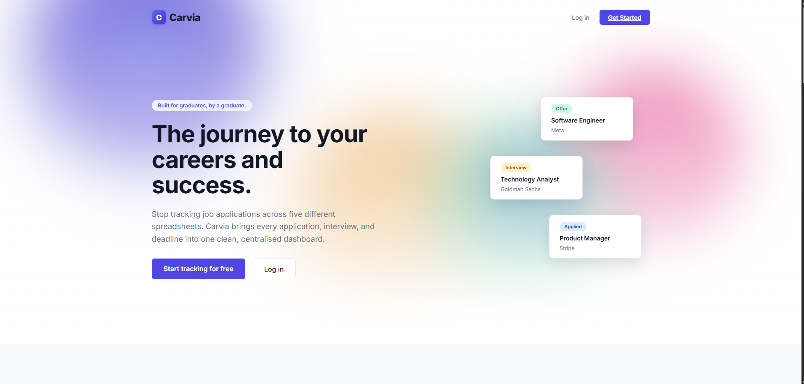
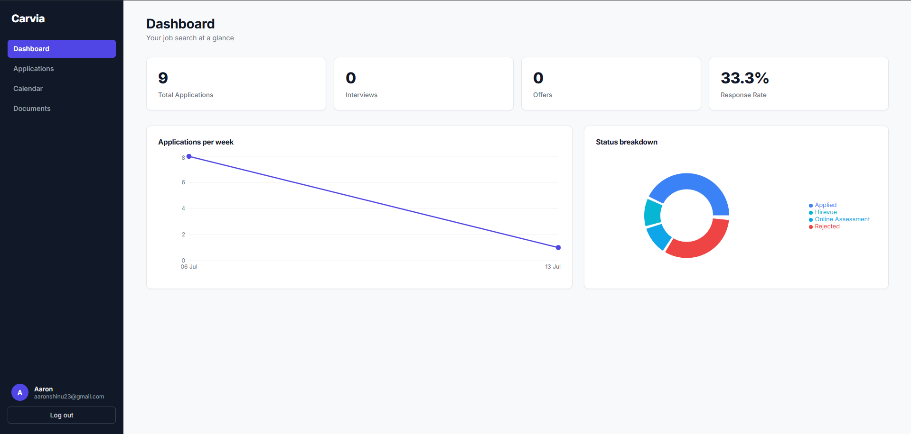
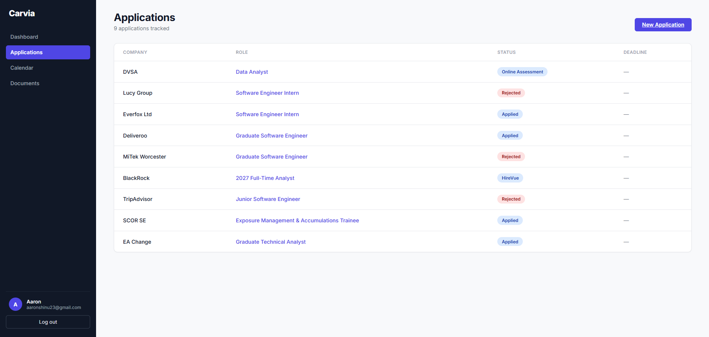
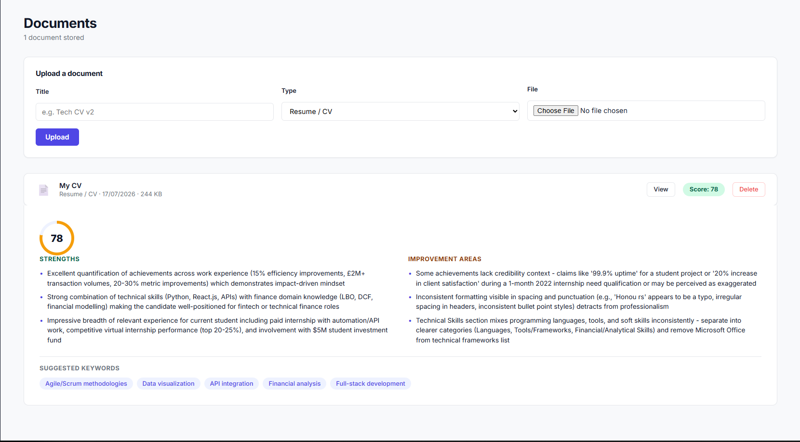
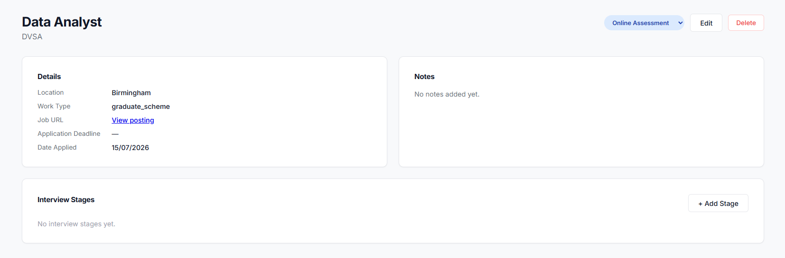

# Carvia

**The way to careers and success.**

Carvia is a full-stack career management platform built for university students and graduates who are tired of tracking job applications across five different spreadsheets, Notion pages, and email threads. It brings applications, interview stages, calendar deadlines, document storage, and AI-powered CV feedback into one clean, centralised dashboard.

**Live app:** [carvia-frontend-production.up.railway.app](https://carvia-frontend-production.up.railway.app)
**Source:** this repository



---

## The problem

Graduate job hunting is a data management problem disguised as a career problem. A single application season can mean 50-100+ applications, each with its own status, deadline, interview pipeline, and CV version — and most people end up tracking all of it across a spreadsheet, a notes app, and their inbox, with nothing talking to anything else. Carvia replaces that with one purpose-built tool.

---

## Key features

- **Application tracking** — full CRUD on applications with a status pipeline (Wishlist to Applied to Interview to Offer/Rejected), search, and filtering
- **Interview stage management** — log phone screens, assessments, and final rounds against each application; mark them passed, failed, or pending
- **Calendar with auto-sync** — scheduling an interview stage automatically creates a matching calendar event, so deadlines and interviews live in one place without duplicate data entry
- **Document storage** — upload CVs, cover letters, and transcripts, stored on Cloudflare R2 (S3-compatible object storage)
- **AI-powered CV feedback** — upload a CV and get a structured, AI-generated review (score, strengths, improvement areas, ATS keyword suggestions), powered by Claude and processed asynchronously via a Celery task queue
- **Analytics dashboard** — live charts (Recharts) showing application volume over time, status breakdown, and response/offer rates
- **JWT authentication** — full register/login/refresh/logout flow with automatic silent token refresh on the frontend

---

## Screenshots

| Dashboard | Applications |
|---|---|
|  |  |

| AI CV Feedback | Application Detail |
|---|---|
|  |  |

---

## Tech stack

**Frontend**
- React (Vite)
- Framer Motion — scroll-linked animations, page transitions, 3D tilt effects
- Recharts — dashboard data visualisation
- react-globe.gl (Three.js) — interactive WebGL globe on the landing page
- Axios with a JWT refresh interceptor

**Backend**
- Django REST Framework
- PostgreSQL
- Redis + Celery — asynchronous task processing for AI feedback generation
- Anthropic API (Claude) — CV analysis
- pypdf / python-docx — CV text extraction
- JWT auth via SimpleJWT

**Infrastructure**
- Docker + Docker Compose — full local dev stack (Django, Postgres, Redis, Celery worker) orchestrated with one command
- Cloudflare R2 — S3-compatible object storage for uploaded documents
- Railway — production deployment (backend, database, Redis, Celery worker, and frontend static hosting)
- WhiteNoise — production static file serving

---

## Architecture notes

A few things worth calling out for anyone reading the code:

- **Async AI processing.** CV feedback requests don't block the HTTP request. Django queues the job via Redis, a separate Celery worker process picks it up, calls the Anthropic API, extracts and parses the response, and writes the result back to Postgres. The frontend polls for completion and renders the result once ready. This is the standard pattern for any slow external API call in a production web app, rather than making a user's browser hang for 15-20 seconds.
- **Multi-service deployment.** The Django API and the Celery worker run as two independent, separately deployed containers built from the same Docker image but with different start commands — a deliberate architectural choice that mirrors how this would be run in most real production environments.
- **Cross-service file access.** Uploaded documents are stored on Cloudflare R2 rather than local disk specifically because the Celery worker (a separate container from the web server) needs to read the same file the user uploaded via Django. Local disk storage doesn't work across separate containers, and doesn't survive redeploys anyway.

---

## Getting started (local development)

**Prerequisites:** Docker Desktop, Node.js, Python 3.13

```bash
git clone https://github.com/AaronShinu/Carvia.git
cd Carvia
```

**Backend** — copy `backend/.env.example` to `backend/.env` and fill in your own values (secret key, database credentials, Anthropic API key), then:

```bash
docker compose up --build
```

This brings up Django, PostgreSQL, Redis, and the Celery worker together.

**Frontend:**

```bash
cd frontend
npm install
npm run dev
```

Visit `http://localhost:5173`.

---

## Roadmap

- Forgot password flow
- Email reminders for upcoming deadlines (Celery beat)
- LinkedIn OAuth integration
- Google Calendar sync
- Dark mode

---

Built as a personal project by [Aaron Shinu](https://github.com/AaronShinu).